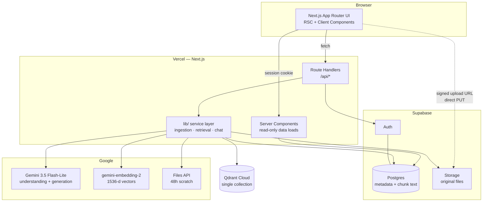
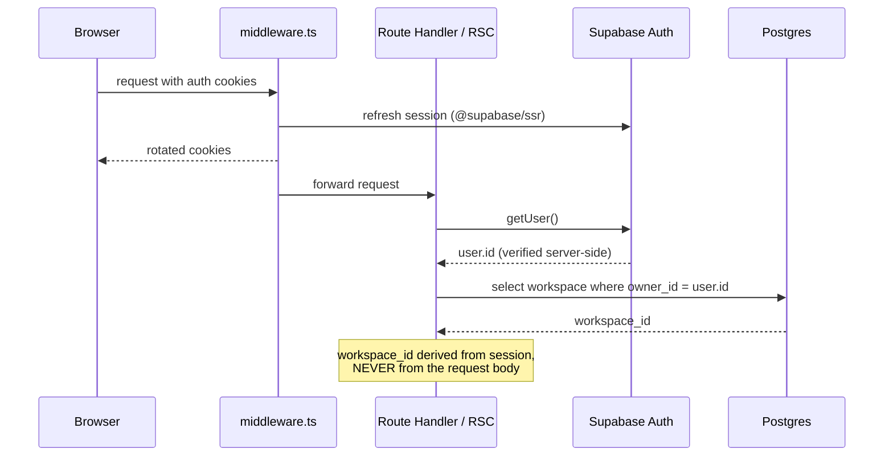
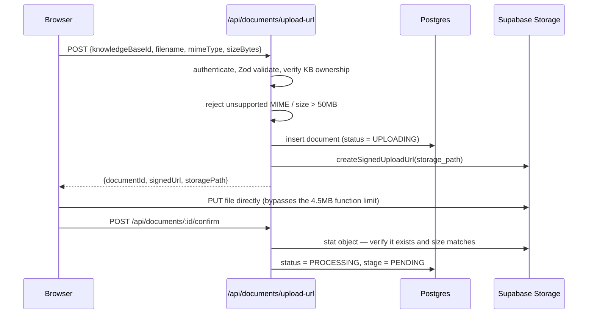
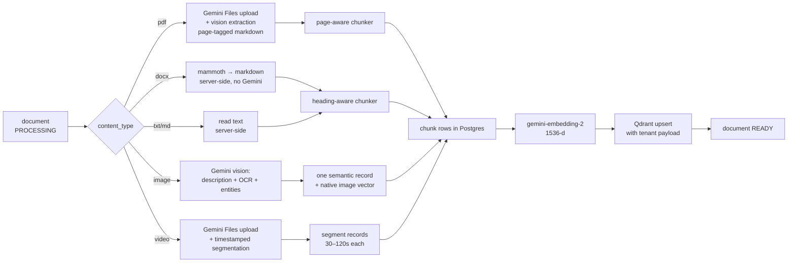
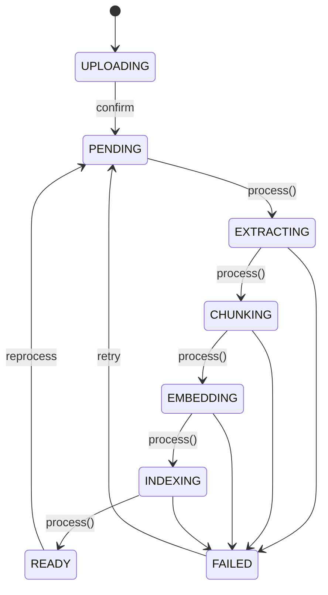
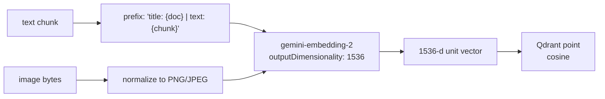
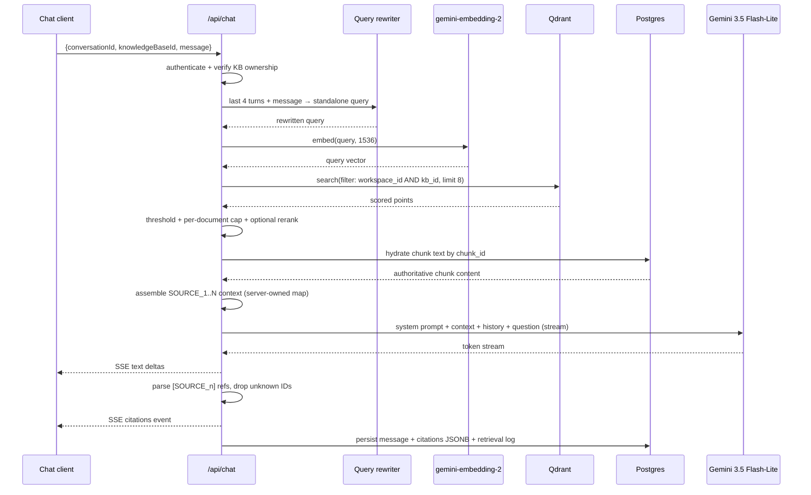
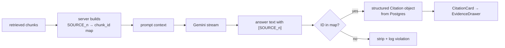
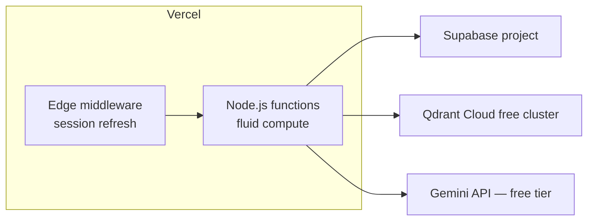

# Retriva — System Architecture

**Status:** Phase 0 architecture (no application code written)
**Date:** 2026-09-08
**Repository state at time of writing:** empty (`git init` only, zero commits, zero tracked files)

> **Product promise:** Upload your knowledge. Ask anything. See the evidence.

---

## 1. System overview

Retriva is a single-deployable Next.js application. There is no separate backend service. Next.js Route Handlers are the API layer, and all privileged work (Gemini, Qdrant, Supabase service operations) happens server-side.

Four external systems, each with exactly one responsibility:

| System | Sole responsibility | Never used for |
|---|---|---|
| **Supabase Postgres** | Source of truth for application metadata and chunk text | Vector search |
| **Supabase Storage** | Source of truth for original uploaded files | Metadata, search |
| **Qdrant Cloud** | Semantic retrieval index (vectors + filterable payload) | Storing authoritative content |
| **Google Gemini API** | Document/image/video understanding, embeddings, grounded generation | Persistence, authorization |

The Gemini Files API is deliberately treated as **temporary processing infrastructure only** — files there expire after 48 hours and cannot be downloaded back. Supabase Storage always holds the durable original.

### Verified platform decisions

| Concern | Decision | Verification note |
|---|---|---|
| Generation model | `gemini-3.5-flash-lite` | `gemini-3.6-flash-lite` **does not exist**; see [technical-decisions.md](./technical-decisions.md) ADR-002 |
| Fallback model | `gemini-3.1-flash-lite` | GA, free tier, multimodal |
| Embedding model | `gemini-embedding-2` | GA (not preview), multimodal, MRL 128–3072 |
| Vector dimensionality | **1536** | Google's own recommendation for vector-DB efficiency; auto-normalized by the model |
| Vector store layout | One collection, tenant payload index | Qdrant's official multitenancy recommendation |
| Upload path | Browser → Supabase Storage via signed upload URL | Vercel route handlers have a hard 4.5 MB body limit |
| Processing model | Resumable, client-driven stage machine | Vercel Hobby fluid compute caps functions at 5 minutes |

---

## 2. Architecture diagram



**Trust boundary:** everything inside `Vercel — Next.js` server-side is trusted. The browser is not. `GEMINI_API_KEY`, `QDRANT_API_KEY`, and `SUPABASE_SECRET_KEY` never cross that boundary.

---

## 3. Component boundaries

```text
src/
├── app/
│   ├── (marketing)/          # public landing, server-rendered
│   ├── (auth)/               # sign-in, sign-up, callback
│   ├── (workspace)/          # authenticated shell
│   └── api/                  # Route Handlers only — orchestration, no logic
│
├── components/
│   ├── ui/                   # shadcn primitives
│   ├── shell/                # AppShell, Sidebar, CommandMenu
│   ├── knowledge/            # KB list, document list, upload
│   └── chat/                 # ChatShell, messages, citations, evidence drawer
│
├── lib/
│   ├── auth/                 # session + ownership resolution
│   ├── db/                   # Supabase clients, typed queries
│   ├── storage/              # signed URLs, path conventions
│   ├── gemini/               # SDK wrapper, model preflight, embeddings, files
│   ├── qdrant/               # client, collection bootstrap, upsert/search/delete
│   ├── ingestion/            # per-modality processors + chunkers
│   ├── retrieval/            # query rewrite, search, rerank, context assembly
│   ├── chat/                 # prompt construction, streaming, citation mapping
│   ├── validation/           # Zod schemas shared by routes
│   └── observability/        # structured retrieval logging for evals
│
├── types/                    # domain types, discriminated unions
└── hooks/                    # client-side data + streaming hooks
```

**Rule enforced by review:** a Route Handler authenticates, validates with Zod, resolves ownership, calls one service function, and shapes the response. No business logic in route files, no business logic in components.

---

## 4. Data flow — authentication



A workspace row is created on first authenticated request (`ensureWorkspace`), keeping the schema ready for multi-workspace/orgs later without changing the RAG layer.

---

## 5. Data flow — upload



The browser never chooses the storage path and never gets a secret key. The signed URL is scoped to one object path that the server generated.

---

## 6. Data flow — ingestion



Full per-modality detail lives in [multimodal-ingestion.md](./multimodal-ingestion.md).

### Why processing is staged rather than one long request

Vercel Hobby caps a function at **5 minutes** (fluid compute). A 20-minute video passed through the Gemini Files API plus segmentation plus embedding can exceed that. Instead of introducing Redis or a worker (explicitly forbidden by the spec's non-goals), ingestion is a **checkpointed state machine advanced one stage per HTTP call**:



`POST /api/documents/:id/process` advances at most one stage (and, within `EMBEDDING`, at most one batch), persists the checkpoint, and returns `{ status, stage, done: boolean }`. The client polls `GET /api/documents/:id/status` and re-invokes while `done === false`. Every stage is idempotent, so a retry never duplicates chunks or vectors.

---

## 7. Data flow — embedding

All modalities converge on one embedding space so that a text question can retrieve a video segment or an image.



Hard per-request limits verified against Google's documentation and designed around:

| Input | Limit | How the architecture respects it |
|---|---|---|
| Text | 8,192 tokens | Chunk target ~700 tokens, hard cap 6,000 |
| Images | 6 per request | One image per request; never batched |
| Video | 120 seconds | Video is **not** natively embedded in the MVP — transcript segments are |
| PDF | 1 file, 6 pages | PDFs are **not** natively embedded — extracted text is |
| Audio | 180 seconds | Out of MVP scope |

`gemini-embedding-2` and `gemini-embedding-001` produce **incompatible embedding spaces**. The collection is therefore stamped with the model that created it, and `chunks.embedding_model` is recorded per row so a future migration is detectable rather than silently corrupting retrieval.

---

## 8. Data flow — retrieval



**Critical detail:** chunk text sent to the model is read from **Postgres**, not from the Qdrant payload. Qdrant returns identifiers and scores; Postgres returns content. This keeps a single source of truth and means a stale vector payload can never inject wrong content into an answer.

---

## 9. Data flow — chat and citations

The model is never asked to invent provenance. The server builds a mapping before generation:

```text
SOURCE_1 → chunk 9f2c… → architecture-final.pdf → page 12
SOURCE_2 → chunk 3a71… → team-meeting.mp4 → 00:23:41–00:24:18
SOURCE_3 → chunk c0d4… → architecture-diagram.png → image
```

The prompt contains only `SOURCE_n` labels. The response is scanned for `[SOURCE_n]` tokens; any ID not present in the server's map is stripped from the rendered answer and logged as a citation violation. Page numbers, timestamps, and filenames come from the database — never from model output.



Detail in [rag-pipeline.md](./rag-pipeline.md) §Citations.

---

## 10. Server / client component boundaries

| Surface | Type | Reason |
|---|---|---|
| App shell, sidebar frame | Server | Static structure, no interactivity |
| Knowledge base list | Server | Read-only DB query, RLS-scoped |
| Document list (initial render) | Server | Read-only |
| Document list (live status) | Client | Polls `/status` during processing |
| Upload dropzone | Client | File API, signed-URL PUT, progress |
| Chat message list (history) | Server | Initial load from Postgres |
| Chat composer + stream | Client | SSE consumption, optimistic UI |
| Citation cards | Server-rendered data, client interaction | Data from RSC, drawer state client-side |
| Evidence drawer | Client | Modal state, PDF page jump, video seek |
| Command menu | Client | Keyboard, focus management |

Streaming chat is the only place requiring a long-lived client connection. Everything else is a normal request/response or a short poll.

---

## 11. Deployment architecture



- **Runtime:** Node.js for every route handler. The Edge runtime is used only for middleware session refresh. Ingestion needs Node APIs (`Buffer`, stream handling, `mammoth`) and must not run on Edge.
- **`maxDuration`:** set explicitly per route — `60` for chat, `300` for `/process` (the Hobby ceiling).
- **Region:** pin the Vercel function region to the Supabase project region to keep Postgres round-trips cheap during ingestion.

---

## 12. Known constraints

| Constraint | Value | Consequence |
|---|---|---|
| Vercel request body | 4.5 MB | Uploads must go direct to Storage via signed URL |
| Vercel Hobby function | 5 min | Ingestion must be staged and resumable |
| Supabase free file size | 50 MB | Hard cap on uploads; demo video must fit |
| Supabase free database | 500 MB before read-only | Chunk text is the main growth driver; monitor |
| Gemini Files API | 48 h lifetime, no download | Scratch only; Storage is the original |
| Gemini PDF input | 50 MB / 1000 pages, 258 tokens/page | Large PDFs need page-range batching |
| `gemini-embedding-2` | 8192 tok / 6 img / 120 s video / 6 PDF pages | Drives the "normalize to text, embed text" design |
| Embedding spaces | `-001` and `-2` incompatible | Model recorded per chunk; no mixing |
| Qdrant free cluster | 0.5 vCPU, 1 GB RAM, 4 GB disk | ~500k vectors at 1536-d — ample for the demo |
| Qdrant free cluster | suspended after 1 week idle | **Demo-day risk** — keep-alive required |
| Gemini free tier | ~15 RPM generation, ~100 RPM embeddings | Embedding batches must be rate-limited and retried |

---

## 13. Major technical decisions (summary)

Full ADRs with options and trade-offs are in [technical-decisions.md](./technical-decisions.md).

1. **No LangChain.** Direct SDK calls. The RAG pipeline is the product; abstraction hides the part being judged.
2. **One Qdrant collection**, tenant-partitioned by payload index — Qdrant's own recommendation, and the only option that keeps a single vector-size contract.
3. **Normalize every modality to text for embedding**, plus a *native* image vector alongside the image's text record. Per-request multimodal embedding limits make direct PDF/video embedding impractical, and text embedding preserves page/timestamp citation granularity.
4. **Chunk text lives in Postgres**, Qdrant holds vectors + filter payload only.
5. **Staged, resumable ingestion** driven by client polling — no queue, no Redis, honest about serverless limits.
6. **Server-owned citation map.** The model may only reference `SOURCE_n` identifiers the server issued.
7. **RLS everywhere, plus explicit server-side ownership resolution.** Defense in depth: even if RLS were misconfigured, no tenant ID from the browser is ever trusted.
