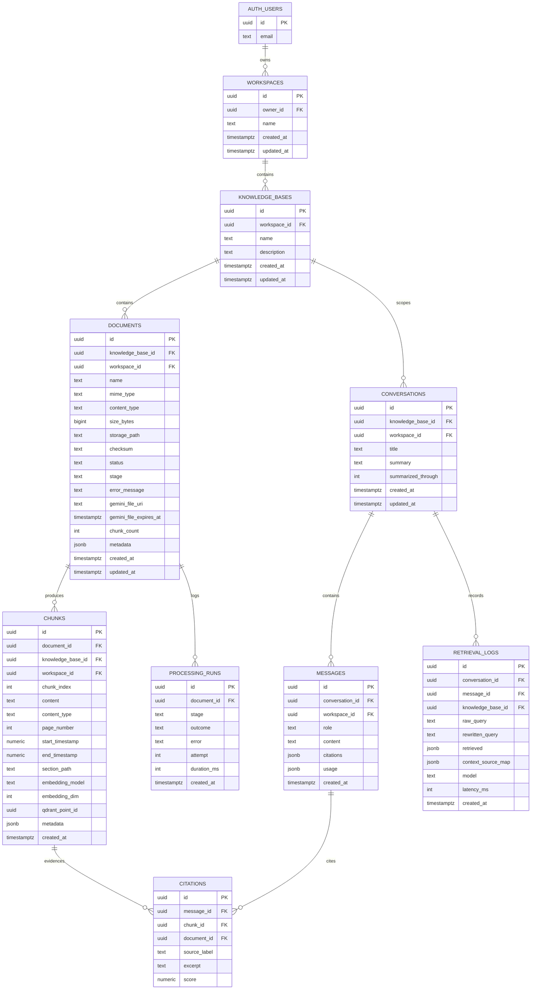

# Retriva — Data Model

**Status:** Phase 0 design. No migrations written.

Three stores, three responsibilities:

- **Postgres** — application metadata *and* authoritative chunk text
- **Supabase Storage** — original uploaded bytes
- **Qdrant** — vectors plus the minimum payload needed to filter and identify

---

## 1. Entity relationship diagram



`AUTH_USERS` is Supabase's `auth.users` — Retriva does not own an application-level users table. Profile data, if ever needed, goes on `workspaces`.

---

## 2. Tables

### `workspaces`

The tenant root. One per user in the MVP.

| Column | Type | Notes |
|---|---|---|
| `id` | `uuid` PK | `gen_random_uuid()` |
| `owner_id` | `uuid` NOT NULL | → `auth.users(id)` ON DELETE CASCADE |
| `name` | `text` NOT NULL | defaults to `'My Workspace'` |
| `created_at` / `updated_at` | `timestamptz` NOT NULL | |

- `UNIQUE (owner_id)` for the MVP. Dropping this constraint is the entire change needed to support multiple workspaces per user later.
- Created lazily by `ensureWorkspace(userId)` on first authenticated request.

### `knowledge_bases`

| Column | Type | Notes |
|---|---|---|
| `id` | `uuid` PK | |
| `workspace_id` | `uuid` NOT NULL | → `workspaces(id)` ON DELETE CASCADE |
| `name` | `text` NOT NULL | `CHECK (char_length(name) BETWEEN 1 AND 120)` |
| `description` | `text` | nullable |
| `created_at` / `updated_at` | `timestamptz` | |

- `UNIQUE (workspace_id, lower(name))` — prevents confusing duplicates in the sidebar.
- Index: `(workspace_id, updated_at DESC)`.

Document counts and readiness are **not** denormalized columns; they come from a view (`knowledge_base_stats`) so they can never drift from the documents table.

### `documents`

| Column | Type | Notes |
|---|---|---|
| `id` | `uuid` PK | |
| `knowledge_base_id` | `uuid` NOT NULL | → `knowledge_bases(id)` ON DELETE CASCADE |
| `workspace_id` | `uuid` NOT NULL | denormalized tenant key, see §5 |
| `name` | `text` NOT NULL | original filename, sanitized for display |
| `mime_type` | `text` NOT NULL | server-sniffed, not client-declared |
| `content_type` | `text` NOT NULL | `pdf \| docx \| text \| markdown \| image \| video` |
| `size_bytes` | `bigint` NOT NULL | `CHECK (size_bytes > 0 AND size_bytes <= 52428800)` |
| `storage_path` | `text` NOT NULL | server-generated, see §6 |
| `checksum` | `text` | sha256 of bytes, for duplicate detection |
| `status` | `text` NOT NULL | `UPLOADING \| PROCESSING \| READY \| FAILED` |
| `stage` | `text` | `PENDING \| EXTRACTING \| CHUNKING \| EMBEDDING \| INDEXING \| DONE` |
| `stage_cursor` | `jsonb` | checkpoint within a stage (e.g. `{"embeddedThrough": 40}`) |
| `error_message` | `text` | user-safe message; details go to `processing_runs` |
| `gemini_file_uri` | `text` | Files API handle, valid 48 h |
| `gemini_file_expires_at` | `timestamptz` | so a resumed run knows to re-upload |
| `chunk_count` | `int` NOT NULL DEFAULT 0 | |
| `metadata` | `jsonb` | page count, duration seconds, dimensions |
| `created_at` / `updated_at` | `timestamptz` | |

Indexes:
- `(knowledge_base_id, created_at DESC)` — document list
- `(workspace_id)` — tenant sweeps and deletion
- `(status)` WHERE `status IN ('UPLOADING','PROCESSING')` — partial index for the poller
- `UNIQUE (knowledge_base_id, checksum)` WHERE `checksum IS NOT NULL` — duplicate uploads rejected with a friendly message rather than silently re-embedded

**`status` vs `stage`:** `status` is the four-value product-facing enum the spec requires and is what the UI renders. `stage` is the internal resumable-pipeline cursor. Keeping them separate means the ingestion state machine can grow stages without changing the product contract.

### `chunks`

The authoritative retrieval unit. Spec calls this `content_chunks`; `chunks` is used here for brevity — either name is fine, pick one at migration time and keep it.

| Column | Type | Notes |
|---|---|---|
| `id` | `uuid` PK | **also used verbatim as the Qdrant point ID** |
| `document_id` | `uuid` NOT NULL | → `documents(id)` ON DELETE CASCADE |
| `knowledge_base_id` | `uuid` NOT NULL | denormalized |
| `workspace_id` | `uuid` NOT NULL | denormalized tenant key |
| `chunk_index` | `int` NOT NULL | ordinal within the document |
| `content` | `text` NOT NULL | authoritative text sent to the model |
| `content_type` | `text` NOT NULL | mirrors `documents.content_type` |
| `page_number` | `int` | PDFs only |
| `start_timestamp` | `numeric(10,2)` | video, seconds |
| `end_timestamp` | `numeric(10,2)` | video, seconds |
| `section_path` | `text` | e.g. `Architecture > Persistence` |
| `embedding_model` | `text` NOT NULL | e.g. `gemini-embedding-2` |
| `embedding_dim` | `int` NOT NULL | e.g. `1536` |
| `vector_kind` | `text` NOT NULL | `text \| image` — see multimodal ingestion |
| `qdrant_point_id` | `uuid` | equals `id`; kept explicit for clarity and future divergence |
| `metadata` | `jsonb` | OCR entities, detected objects, speaker labels |
| `created_at` | `timestamptz` | |

Indexes:
- `UNIQUE (document_id, chunk_index, vector_kind)`
- `(knowledge_base_id)`
- `(document_id)`
- `(workspace_id)`

`CHECK` constraints enforce provenance sanity, e.g. `page_number IS NULL OR content_type = 'pdf'`, and `(start_timestamp IS NULL) = (end_timestamp IS NULL)`.

### `conversations`

| Column | Type | Notes |
|---|---|---|
| `id` | `uuid` PK | |
| `knowledge_base_id` | `uuid` NOT NULL | conversations are scoped to one KB |
| `workspace_id` | `uuid` NOT NULL | |
| `title` | `text` | auto-generated from the first user message |
| `summary` | `text` | rolling summary of older turns |
| `summarized_through` | `int` DEFAULT 0 | message ordinal covered by `summary` |
| `created_at` / `updated_at` | `timestamptz` | |

Index: `(knowledge_base_id, updated_at DESC)`.

### `messages`

| Column | Type | Notes |
|---|---|---|
| `id` | `uuid` PK | |
| `conversation_id` | `uuid` NOT NULL | ON DELETE CASCADE |
| `workspace_id` | `uuid` NOT NULL | |
| `role` | `text` NOT NULL | `user \| assistant` |
| `content` | `text` NOT NULL | |
| `citations` | `jsonb` NOT NULL DEFAULT `'[]'` | denormalized render payload |
| `usage` | `jsonb` | token counts, latency, model used |
| `created_at` | `timestamptz` | |

Index: `(conversation_id, created_at)`.

**Why both `messages.citations` (JSONB) and a `citations` table:** the JSONB column is the render payload — one read gets a message and everything needed to draw its source cards, which keeps chat history loading fast. The relational `citations` table exists so evaluation and analytics can join citations to chunks and documents without parsing JSON, and so a deleted document can be detected as an orphaned citation. The JSONB is a projection; the table is the join key. They are written in the same transaction.

### `citations`

| Column | Type | Notes |
|---|---|---|
| `id` | `uuid` PK | |
| `message_id` | `uuid` NOT NULL | ON DELETE CASCADE |
| `chunk_id` | `uuid` | ON DELETE SET NULL — evidence may be deleted later |
| `document_id` | `uuid` | ON DELETE SET NULL |
| `source_label` | `text` NOT NULL | `SOURCE_1`, … as issued for that turn |
| `excerpt` | `text` NOT NULL | snapshot of the cited text at answer time |
| `score` | `numeric` | similarity at retrieval time |

The `excerpt` is snapshotted deliberately: if the user deletes the document tomorrow, the historical answer still shows what it was based on, clearly marked as an unavailable source.

### `processing_runs`

Append-only ingestion audit. One row per stage attempt. Powers the failure UI ("Reading document… failed at extraction") and post-demo debugging. Not exposed in the normal UI.

### `retrieval_logs`

Append-only. One row per assistant turn: raw query, rewritten query, retrieved chunk IDs with scores, the `SOURCE_n` map, model, latency. This is the substrate for [evaluation.md](./evaluation.md) and is never returned to the browser.

---

## 3. Processing states

Product-facing (`documents.status`):

```text
UPLOADING → PROCESSING → READY
                  ↓
                FAILED
```

Internal (`documents.stage`), advanced one step per `/process` call:

```text
PENDING → EXTRACTING → CHUNKING → EMBEDDING → INDEXING → DONE
```

| Stage | Work | Idempotency guarantee |
|---|---|---|
| `EXTRACTING` | modality-specific text/segment extraction; writes `metadata` | re-runs overwrite extraction output |
| `CHUNKING` | delete existing chunks for the document, insert fresh | delete-then-insert in one transaction |
| `EMBEDDING` | embed chunks in rate-limited batches, advancing `stage_cursor.embeddedThrough` | resumes from cursor; already-embedded chunks skipped |
| `INDEXING` | Qdrant upsert keyed by `chunk.id` | upsert by fixed ID is naturally idempotent |
| `DONE` | set `status = READY`, `chunk_count` | — |

Failure sets `status = FAILED`, records the stage in `error_message`, and leaves `stage` where it broke so retry resumes rather than restarts.

---

## 4. Deletion behavior

Deletion must be complete across all three stores or it becomes a cross-tenant leak vector.

| Action | Postgres | Storage | Qdrant |
|---|---|---|---|
| Delete document | cascade removes chunks, citations set null | delete object at `storage_path` | `delete(filter: document_id = X)` |
| Delete knowledge base | cascade removes documents, chunks, conversations, messages | delete `…/kb/{id}/` prefix | `delete(filter: knowledge_base_id = X)` |
| Delete workspace / user | cascade from `auth.users` | delete `…/ws/{id}/` prefix | `delete(filter: workspace_id = X)` |

Order matters: **Qdrant first, then Storage, then Postgres.** If the process dies midway, the worst outcome is orphaned Postgres metadata pointing at nothing — visible and repairable. The reverse order could leave live vectors with no owning row, which is unretrievable garbage that still matches searches.

Because deletion spans systems that cannot share a transaction, a `deleted_at` soft-delete column on `documents` and `knowledge_bases` marks the row immediately (making it invisible to every query and to retrieval) before external cleanup begins. A row is hard-deleted only after Qdrant and Storage confirm. Retrieval filters `deleted_at IS NULL` and the Qdrant filter is additionally scoped, so a partially-deleted document can never surface as evidence.

---

## 5. Tenant key denormalization

`workspace_id` is duplicated onto `documents`, `chunks`, `conversations`, and `messages` even though it is derivable by joining upward. This is intentional:

1. **RLS policies stay single-table and cheap.** No recursive joins in a policy that runs on every row.
2. **The Qdrant payload needs it directly** — the vector filter is on `workspace_id`, and it must match exactly what Postgres holds.
3. **Deletion and audit become one-predicate operations.**

Consistency is enforced by triggers that derive `workspace_id` from the parent on insert rather than trusting the inserting code, and by `FOREIGN KEY (knowledge_base_id, workspace_id) REFERENCES knowledge_bases(id, workspace_id)` composite keys, which make a mismatched pair impossible at the database level.

---

## 6. Storage layout

```text
documents/                       # private bucket
  ws/{workspace_id}/
    kb/{knowledge_base_id}/
      {document_id}/
        original.{ext}
        derived/
          page-012.png           # optional PDF page renders for evidence preview
          poster.jpg             # video poster frame
```

- Bucket is **private**. No public URLs anywhere.
- Paths are server-generated from IDs the server resolved. The client never supplies a path.
- Evidence viewing uses short-lived signed download URLs (5 minutes) minted per request after an ownership check.
- Putting `workspace_id` first makes both the RLS storage policy and bulk deletion a prefix operation.

---

## 7. RLS strategy

RLS is enabled on **every** application table. Policies use the pattern:

```sql
-- workspaces
USING (owner_id = auth.uid())

-- every descendant table
USING (workspace_id IN (SELECT id FROM workspaces WHERE owner_id = auth.uid()))
```

A `SECURITY DEFINER` helper `current_workspace_ids()` wraps that subquery so policies stay readable and the plan is cached.

Storage policies mirror the layout: a user may read/write objects in `documents` only where the second path segment equals one of their workspace IDs.

### Where RLS is sufficient, and where it is not

| Operation | Client used | Protection |
|---|---|---|
| Reading KBs, documents, conversations, messages in RSC | Publishable-key client bound to the user's session cookie | **RLS** |
| Creating/updating/deleting user-owned rows via routes | Publishable-key client bound to session | **RLS** |
| Minting signed upload/download URLs | Session-bound client | RLS + explicit ownership check |
| Qdrant search and delete | Server-only Qdrant client | **RLS does not apply** — see below |
| Gemini calls | Server-only | N/A |
| Migrations, collection bootstrap | Secret key, offline/CLI | Never in a request path |

**The secret key is never used in a request handler that touches a client-supplied ID.** The default database client for route handlers is the session-bound publishable-key client, so RLS is an active second line of defense rather than a bypassed one.

RLS gives no protection at all for Qdrant, which has no concept of the Postgres session. Tenant isolation there is enforced entirely by a server-constructed filter — see §8 and [security.md](./security.md).

---

## 8. Qdrant payload schema

One collection, `retriva`.

```jsonc
// Collection config
{
  "vectors": { "size": 1536, "distance": "Cosine" },
  "optimizers_config": { "default_segment_number": 2 }
}
```

Point ID = `chunks.id` (UUID). Payload:

```jsonc
{
  "workspace_id":      "uuid",   // tenant key — keyword index, is_tenant: true
  "knowledge_base_id": "uuid",   // keyword index
  "document_id":       "uuid",   // keyword index
  "chunk_id":          "uuid",   // equals the point ID; kept for readability in logs
  "content_type":      "pdf",    // keyword index — pdf|docx|text|markdown|image|video
  "vector_kind":       "text",   // keyword index — text|image
  "document_name":     "architecture-final.pdf",
  "page_number":       12,       // nullable
  "start_timestamp":   1421.0,   // nullable
  "end_timestamp":     1458.0,   // nullable
  "section_path":      "Architecture > Persistence"
}
```

**The payload deliberately does not contain chunk text.** Content is hydrated from Postgres after search. This keeps the free-tier Qdrant cluster small, guarantees one source of truth for what the model sees, and means a payload that somehow drifted cannot inject content into an answer.

Required payload indexes, created at collection bootstrap:

```text
workspace_id       keyword, is_tenant: true
knowledge_base_id  keyword
document_id        keyword
content_type       keyword
vector_kind        keyword
```

`is_tenant: true` is Qdrant's documented multitenancy optimization — it co-locates a tenant's vectors on disk so a filtered search is a sequential read rather than random seeks. On a 0.5 vCPU free cluster this matters.

Every search **must** carry, at minimum:

```jsonc
{ "must": [
  { "key": "workspace_id",      "match": { "value": "<from session>" } },
  { "key": "knowledge_base_id", "match": { "value": "<ownership-verified>" } }
]}
```

The Qdrant wrapper in `lib/qdrant/` exposes no function that can search without a `workspace_id`. It is a required, non-optional argument on the search type — a search missing tenant scope should be a **type error**, not a code-review catch.
